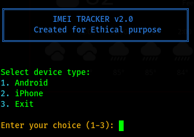

# IMEI Tracker

A Python-based tool for tracking IMEI information.

## Setup

### 1. Clone the Repository

```bash
git clone https://github.com/hackerjoe69/IMEI-TRACKER.git
cd IMEI-TRACKER
```

### 2. Create a Virtual Environment

**Linux/macOS:**
```bash
python3 -m venv venv
source venv/bin/activate
```

**Windows:**
```bash
python -m venv venv
venv\Scripts\activate
```

### 3. Install Dependencies

```bash
pip install -r requirements.txt
```

## Usage

**Linux/macOS:**
```bash
python3 tracker.py
```

**Windows:**
```bash
python tracker.py
```

## Requirements

- Python 3.x
- Dependencies listed in `requirements.txt`

## Screenshot


## 👤 Author

**hackerjoe69**

- GitHub: [@hackerjoe69](https://github.com/hackerjoe69)